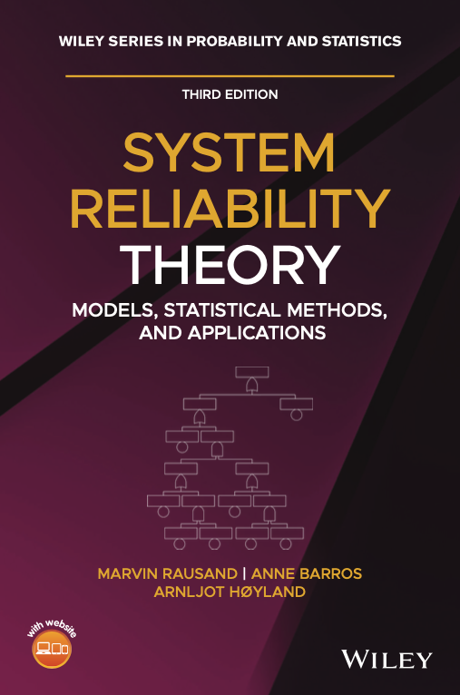

# **System Reliability Theory - Models, Statistical Methods, and Applications** 3rd edition.


---
In this repository you will find scripts, datasets, examples developped in the book ["System Reliability Theory; Models, Statistical Methods and Applications"](https://www.wiley.com/en-fr/System+Reliability+Theory%3A+Models%2C+Statistical+Methods%2C+and+Applications%2C+3rd+Edition-p-9781119374015 "WILEY book's Wepage") by M. Rausand, A. Barros, A. Høyland.



---
## Table of Contents
    1. Repository description
    2. Get the repository
    3. Get the environment
    4. Bug reports
    5. License

---
## 1. Repository description

To facilitate the understanding of notebooks, we tried to minimize the call to external subfunctions. The advantage is that notebooks are independent and subfunctions are directly defined at the notebook level and are rather simple. The inconvenient is that several notebooks have the *same* subfunctions and that they might slightly differe form one to another... The reader should be aware of that.

Below is a tree view of the repository relying on the book's sections numbering:
```
.
├── 05_ProbabilityDistributionsInReliabilityAnalysis
│   ├── 05_04_SomeTimeToFailureDistributions                 --> R Code
│   │   ├── 05_04_02_TheGammaDistribution.ipynb              --> R Code
│   │   ├── 05_04_03_TheWeibullDistribution.ipynb            --> R Code
│   │   ├── 05_04_04_TheNormalDistribution.ipynb             --> R Code
│   │   └── 05_04_05_TheLognormalDistribution.ipynb          --> R Code
│   └── 05_07_AdditionalContinuousDistributions
│       └── 05_07_02_TheBetaDistribution.ipynb               --> R Code
├── 06_SystemReliabilityAnalysis
│   └── 06_03_NonRepairableSystems
│       └── 06_03_02_NonrepairableParallelStructures.ipynb   --> R Code
├── 10_CountingProcesses
│   └── 10_07_Problems
│       ├── 10_07_Dataset_Problem_10_13.txt                  --> Dataset
│       └── TestDataLoading.ipynb                            --> R Code
├── 11_MarkovAnalysis
│   ├── 11_09_TimeDependentSolution.ipynb                    --> Python
│   ├── 11_11_MultiphaseMarkovProcesses                      
│   │   ├── 11_11_01_ChangingTheTransitionRates.ipynb        --> Python
│   │   └── 11_11_02_ChangingTheInitialState.ipynb           --> Python
│   ├── 11_12_PiecewiseDeterministicMarkovProcesses  
│   │   └── 11_12_03_ASpecificCase.ipynb                     --> Python
│   └── 11_13_SimulationOfAMarkovProcess.ipynb               --> Python
├── 12_PreventiveMaintenance
│   ├── 12_04_DegradationModels                              
│   │   ├── 12_04_02_TrendModelsRegressionBasedModels.ipynb  --> Python
│   │   └── 12_04_03_ModelsWithIncrements.ipynb              --> Python
│   └── 12_05_ConditionBasedMaintenance
│       ├── 12_05_02_ContinuousMonitoringAndFiniteDiscreteStateSpace1.ipynb              --> Python
│       ├── 12_05_02_ContinuousMonitoringAndFiniteDiscreteStateSpace2.ipynb              --> Python
│       ├── 12_05_02_ContinuousMonitoringAndFiniteDiscreteStateSpace3.ipynb              --> Python
│       ├── 12_05_04_InspectionBasedMonitoringAndFiniteDiscreteStateSpace.ipynb          --> Python
│       └── 12_05_05_InspectionBasedMonitoringAndContinuousStateSpace.ipynb              --> Python
├── 14_ReliabilityDataAnalysis
│   ├── 14_02_SomeBasicConcepts
│   │   └── 14_02_02_SurvivalTimes.ipynb                     --> R Code                            
│   ├── 14_03_ExploratoryDataAnalysis
│   │   ├── 14_03_01_ACompleteDataset.ipynb                  --> R Code
│   │   ├── 14_03_02_SampleMetrics.ipynb                     --> R Code
│   │   ├── 14_03_03_Histogram.ipynb                         --> R Code
│   │   ├── 14_03_04_DensityPlot.ipynb                       --> R Code
│   │   ├── 14_03_05_EmpiricalSurvivorFunction.ipynb         --> R Code
│   │   ├── 14_03_06_QQPlot.ipynb                            --> R Code
│   │   └── 14_03_dataset.txt                                --> Dataset
│   ├── 14_04_ParameterEstimation
│   │   ├── 14_04_03_MethodOfMomentsEstimation.ipynb         --> R Code
│   │   ├── 14_04_04_MaximumLikelihoodEstimation.ipynb       --> R Code
│   │   ├── 14_04_06_WeibullDistributedLifetimes.ipynb       --> R Code
│   │   └── 14_04_dataset.txt                                --> Dataset
│   ├── 14_05_TheKaplanMeierEstimate
│   │   └── 14_05_02_TheKaplanMeierEstimatorForACensoredDataset.ipynb                     --> R Code
│   ├── 14_06_CumulativeFailureRatePlots
│   │   └── 14_06_01_TheNelsonAalenEstimateOfTheCumulativeFailureRate.ipynb               --> R Code
│   ├── 14_07_TotalTimeOnTestPlotting
│   │   └── 14_07_01_TotalTimeOnTestPlotForCompleteDatasets.ipynb                         --> R Code                       
│   └── 14_09_Problems
│       ├── 14_09_Dataset_Problem_14_01.txt                  --> Dataset                      
│       ├── 14_09_Dataset_Problem_14_02.txt                  --> Dataset
│       ├── 14_09_Dataset_Problem_14_03.txt                  --> Dataset
│       ├── 14_09_Dataset_Problem_14_11.txt                  --> Dataset
│       ├── 14_09_Dataset_Problem_14_12.txt                  --> Dataset
│       ├── 14_09_Dataset_Problem_14_13.txt                  --> Dataset
│       ├── 14_09_Dataset_Problem_14_16.txt                  --> Dataset
│       ├── 14_09_Dataset_Problem_14_17.txt                  --> Dataset
│       ├── 14_09_Dataset_Problem_14_18.txt                  --> Dataset
│       └── TestDataLoading.ipynb                            --> R Code
├── 15_BayesianReliabilityAnalysis
│   └── 15_03_SelectionOfPriorDistribution
│       └── 15_03_01_BinomialModel.ipynb                     --> R Code
├── ReliabilityBookEnv.yml                                   --> Environment definition
├── LICENSE.txt                                              --> License
└── README.md
```

---

## 2. Get the repository

To get the repository, run:
```bash
git clone https://github.com/RausandBarros/ReliabilityBookScripts.git
```
or simply download it as ZIP file from the GitHub page.

The link with the repository may be removed by deleting the `\.git` folder.

---

## 3. Python installation

Anaconda is a package and environment manager. It is a common practice to dedicate a specific environment to each project to ensure its consistency and limit potential interdependence with other projects. This is especially needed when several people share/work on the same project. In the following, we assume that Anaconda’s latest version (Python 3.7) <https://www.anaconda.com/distribution/> is installed on your computer (Windows, macOS or Linux) and is up to date.

### 3.1. Environment installation

Use command line interface:
    - Windows: click Start, search or select `Anaconda Prompt` from the menu
    - macOS or Linux: open a terminal window

Run command with the path to the file `ReliabilityBookEnv.yml` correctly set:
```bash
conda env create -f ./MY/PATH/TO/ReliabilityBookEnv.yml
```
You should be able to check the installation by running the following command that list installed environments (i.e. `ReliabilityBookEnv`):
```bash
conda env list
```

### 3.2. Run Jupyter and notebooks

Still from the command line interface, start the `ReliabilityBookEnv` environment by running the command:
```bash
conda activate ReliabilityBookEnv
```

Then, launch Jupyter with the command:
```bash
jupyter notebook
```

Then use Jupyter's interface to move to the folder where the repository has been cloned or copied.

Here are the instructions:
    - to install the python's environment according to this repository Requirements;
    - to run *Jupyter* and therefore the notebooks provided within this repository.

At the end of the session, deactivate the environment with command:
```bash
conda deactivate
```

The environment might be deleted with command:
```bash
conda remove --name ReliabilityBookEnv --all
```

---

## 4. Bug reports

Bug reports would be appreciated and may be filed through the
[issue tracker](https://github.com/RausandBarros/ReliabilityBookScripts/issues). Pull requests won't be accepted except by invitation. Please file an issue first through the former link.

---
## 5. License

This project is licensed under the terms of the MIT license (see file `License.txt`).
